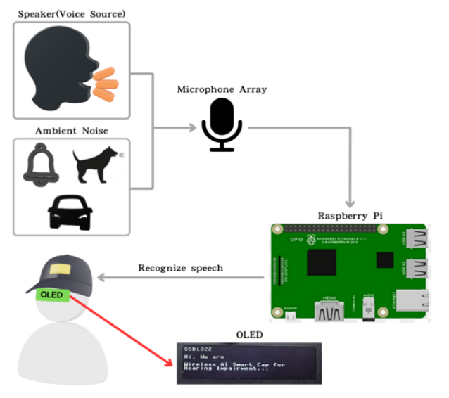
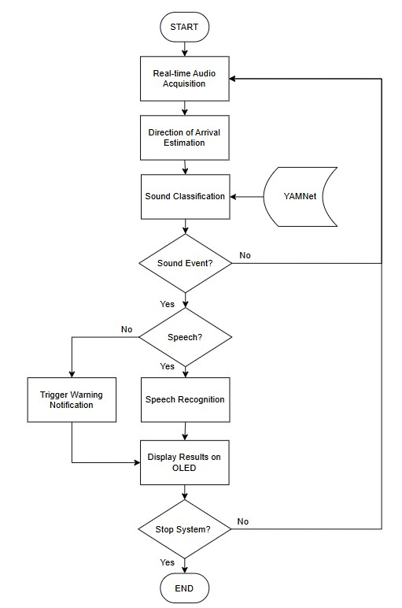
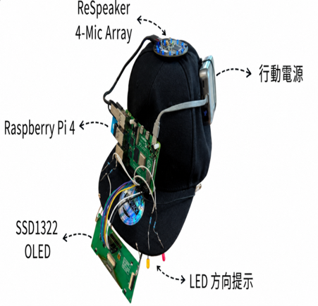
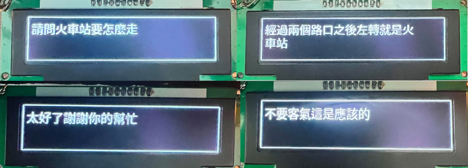
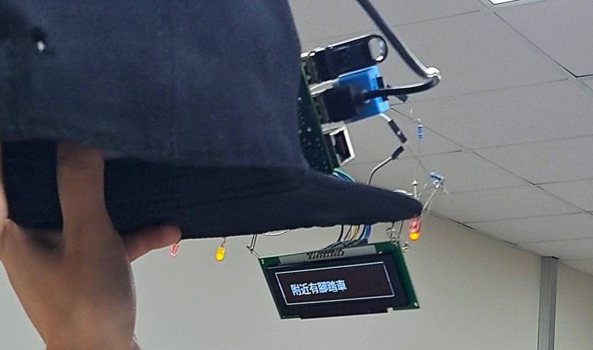

# VISTRA Smart Hat

VISTRA is an open-source AI-assisted smart hat designed to provide visualized auditory information for hearing-impaired users.

The system is implemented on a Raspberry Pi and integrates speech recognition, hazardous sound recognition, sound-source direction estimation, OLED display, and LED indicators.

## Main Features

- Real-time speech transcription using Whisper / whisper.cpp
- Hazardous environmental sound recognition using YAMNet
- Sound-source direction estimation using a ReSpeaker microphone array
- OLED display for speech subtitles and warning messages
- LED indicators for sound-source direction
- Edge AI processing on Raspberry Pi
- Offline operation without continuous cloud connection

## Open-Source AI Models and Tools

### Whisper

Whisper is an automatic speech recognition model developed by OpenAI.

In this project, Whisper is used to convert spoken audio into real-time text subtitles.

Official repository:  
https://github.com/openai/whisper

### whisper.cpp

whisper.cpp provides a lightweight C/C++ implementation of Whisper suitable for edge devices such as Raspberry Pi.

Official repository:  
https://github.com/ggml-org/whisper.cpp

### YAMNet

YAMNet is an audio event classification model based on MobileNet and trained using AudioSet.

In this project, YAMNet is used to recognize important environmental sounds and hazardous sound events.

Official source:  
https://www.tensorflow.org/hub/tutorials/yamnet

## Hardware

- Raspberry Pi 4B
- ReSpeaker USB Microphone Array
- SSD1322 OLED Display
- LED Indicators
- Portable Power Supply
- Wearable Hat Prototype

## System Functions

The system converts auditory information into visual information for hearing-impaired users.

1. Speech is captured through the microphone array.
2. Whisper converts speech into text.
3. YAMNet detects important environmental sound events.
4. DoA estimates the direction of the sound source.
5. OLED displays speech subtitles and warning information.
6. LEDs indicate the direction of important sound sources.

## Project Images

### System Architecture



### System Flowchart



### Smart Hat Prototype



### OLED Display Demo



### LED Direction Demo



## Project Structure

```text
VISTRA-Smart-Hat/
├── src/
│   ├── ASR/
│   ├── YAMNet/
│   ├── DoA/
│   ├── OLED/
│   └── Integrated_System/
├── docs/
├── README.md
├── requirements.txt
└── LICENSE
```

## Installation and Setup

### 1. Install Python dependencies

Install the required Python packages:

```bash
pip install -r requirements.txt
```

### 2. Install whisper.cpp

Clone and build whisper.cpp on the Raspberry Pi.

Official repository:

https://github.com/ggml-org/whisper.cpp

The current system uses the `ggml-tiny.bin` Whisper model.

Expected default paths:

```text
~/whisper.cpp/build/bin/whisper-cli
~/whisper.cpp/models/ggml-tiny.bin
```

### 3. Prepare YAMNet files

Place the following files in the same directory as `vistra_main.py`:

```text
yamnet.tflite
yamnet_class_map.csv
```

These files are used for environmental sound classification.

### 4. Configure ReSpeaker DoA

The system uses the ReSpeaker USB microphone array for audio capture and Direction of Arrival (DoA) estimation.

The ReSpeaker tuning module should be available under:

```text
~/pixel_ring/usb_4_mic_array/
```

The program imports:

```python
from usb_4_mic_array.tuning import Tuning
```

### 5. Connect the OLED and LEDs

The current implementation uses:

- SSD1322 OLED display through SPI
- Four GPIO-controlled direction LEDs
- Raspberry Pi GPIO pins 17, 27, 22, and 23

### 6. Run the integrated system

Move to the integrated system directory:

```bash
cd src/Integrated_System
```

Run:

```bash
python3 vistra_main.py
```

Press `Ctrl+C` to stop the system.

## License

The source code developed for this project is released under the MIT License.

Third-party models, libraries, and tools used in this project remain subject to their respective original licenses.
